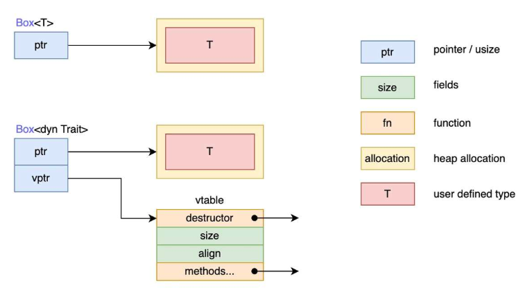

## 泛型

**函数泛型**

```rust
fn foo<T>(arg: &T) -> &T {
    // ...
}

// 显式指定泛型参数
foo::<i32>(...);
```

**结构体泛型**

```rust
struct Point<T> {
    x: T,
    y: T
}

// 显式指定泛型参数
let point: Point<i32> = Point::<i32> { x: 0, y: 0 };
```

**枚举泛型**

```rust
enum Option<T> {
    Some(T),
    None
}
```

**方法泛型**

```rust
struct Point<T> {
    x: T,
    y: T,
}

// 必须在impl之后加上<T>，表示这是泛型参数
impl <T> Point<T> {
    fn x(&self) -> &T {
        &self.x
    }
}

// 为指定泛型参数实现方法
// 只有Point<i32>类型的实例可以调用实现的方法
impl Point<i32> {
    fn foo(&self) {}
}

let point = Point { x: 0, y: 0 };  // 类型推断为Point<i32>
point.foo();
```

### const泛型

const泛型是使用**值**而不是类型作为泛型参数，需要指定值的类型

```rust
// 一个N维坐标点类型
// N是一个const泛型参数，用于指定index数组的类型
struct Point<T, const N: usize> {
    index: [T; N],
}

// 两个变量是不同的类型
let p1: Point<i32, 2> = Point::<i32, 2> { index: [1, 2] };
let p2: Point<i32, 3> = Point::<i32, 3> { index: [1, 2, 3] };
```

作为函数的泛型参数时，可以作为常量用于函数体中

```rust
// const泛型参数可以用于函数中
fn foo<const N: usize>(arr: &[i32; N]) {
    for i in 0..N {
        println!("{}", arr[i])
    }
}

fn foo1<const N: usize>(point: Point<i32, N>) {
    // ...
}

// 显式指定const泛型参数，实现限制数组参数的长度
let arr = [1, 2, 3];
foo::<3>(&arr);  // 必须传入长度为3的数组

let point = Point { index: [1, 2, 3] };  // 自动推断
foo1::<3>(&point);  // 必须传入Point<i32, 3>类型
```

const泛型参数可以传入一个常量表达式，使用大括号包围

```rust
let arr = [1, 2, 3];
foo::<{ 2 + 1 }>(&arr);  // 必须传入长度为3的数组
```

**常量函数**

使用`const`修饰一个函数，表示它是常量函数，常量函数会在编译期执行，将计算的常量值结果在调用处替换

```rust
fn foo<const N: usize>(arr: &[i32; N]) {
    for i in 0..N {
        println!("{}", arr[i])
    }
}

const fn calculate_size() -> usize { 2 + 1 }

let arr = [1, 2, 3];
foo::<{ calculate_size() }>(&arr);  // 在编译期得出foo的参数类型为&[i32; 3]
```

### 泛型的性能

rust的泛型与java不同，java仅在编译期检查类型，之后进行类型擦除，在运行时会丢失类型信息，而rust在编译时，会生成不同具体类型的代码，再将泛型定义替换为具体定义，避免了类型擦除问题，这称为**单态化**

例如，使用Option枚举，单态化会为每种具体类型生成具体代码

```rust
let integer = Some(5);
let float = Some(5.0);

// 单态化生成以下代码
enum Option_i32 {
    Some(i32),
    None,
}

enum Option_f64 {
    Some(f64),
    None,
}

fn main() {
    let integer = Option_i32::Some(5);
    let float = Option_f64::Some(5.0);
}
```

## Trait

一个类型的行为由其可供调用的方法构成，如果可以对不同类型调用相同的方法的话，这些类型就可以共享相同的行为了，Trait是一种包含多个方法的集合，类似于接口

```rust
pub trait Summary {
    fn summarize(&self) -> String;
}
```

为类型实现Trait

```rust
pub struct NewsArticle

impl Summary for NewsArticle {
    fn summarize(&self) -> String {
        // ...
    }
}

let news = NewsArticle;
news.summarize();
```

Trait可以有默认实现

```rust
pub trait Summary {
    fn summarize(&self) -> String {
        String::from("(Read more...)")
    }
}
```

### Trait约束

可以将函数的参数指定为实现了某个Trait的类型

```rust
pub trait Summary {
    fn summarize(&self) -> String;
}

// 指定参数和返回值必须实现了Summary Trait
pub fn notify(item: &impl Summary) -> &impl Summary { item }
```

以上实际是Trait约束（Trait Bound）的语法糖

```rust
// 限制必须是实现Summary的同一个类型
fn notify<T: Summary>(item: &T) -> &T { item }
// 等价于fn notify1(item: &impl Summary) -> &impl Summary { item }
fn notify1<T: Summary, U: Summary>(item: &T) -> &U { item }
```

在实现方法时指定Trait约束可以有条件地实现方法

```rust
struct Pair<T> {
    x: T,
    y: T,
}

// 为T类型实现了PartialOrd Trait的Pair<T>实现方法
impl<T: PartialOrd> Pair<T> {
    fn cmp_display(&self) {
        if self.x >= self.y {
            println!("The largest member is x = {}", self.x);
        } else {
            println!("The largest member is y = {}", self.y);
        }
    }
}
```

**多个泛型参数的语法糖**

使用`+`指定多个Trait

```rust
// 参数需要实现Summary和Display两个Trait
fn notify(item: &(impl Summary + Display)) {
    // ...
}

// Trait Bound
fn notify1<T: Summary + Display>(item: &T) {
    // ...
}
```

使用`where`关键字简化Trait约束

```rust
fn some_function<T: Display + Clone, U: Clone + Debug>(t: &T, u: &U) -> i32 {
    // ...
}

// 在where语句中统一设置Trait约束
fn some_function1<T, U>(t: &T, u: &U) -> i32
where
    T: Display + Clone,
    U: Clone + Debug,
{
    // ...
}
```

### Trait对象

当在返回值类型上使用Trait约束时，rust不允许返回不同类型的对象，即使它们满足Trait约束

例如下面的代码，编译无法通过

```rust
fn returns_summarizable(switch: bool) -> impl Summary {
    if switch {
        // 返回Post类型
        Post {
           // ...
        }
    } else {
        // 返回Weibo类型
        Weibo {
            // ...
        }
    }
}
```

编译无法通过是因为rust无法在编译期确定返回值类型，函数可能返回Post类型，也可能返回Weibo类型，只能在运行时确定

当代码中引入多态时，需要一种机制确定实际调用的类型，这称为**分发**，分发分为**静态分发**和**动态分发**

- 静态分发：在编译期确定实际类型
- 动态分发：在运行时确定实际类型

rust默认使用单态化生成具体类型代码，在编译期就确定了实际类型，即实现了静态分发。但对于上述代码无法在编译期确定实际类型，只能在运行时确定实际类型的情况，就需要使用动态分发

从类型的角度看，一个Trait是包含了具有某种特性的类型的集合，**Trait本身也可以看做一个类型**，将Trait作为类型的特性在rust中通过Trait对象（Trait Object）实现，同时rust通过Trait对象实现了动态分发

例如，通过Trait对象在Vec中保存不同的类型，定义以下Trait和类型

```rust
trait A {}

struct AImpl1;
struct AImpl2;
impl A for AImpl1 {}
impl A for AImpl2 {}
```

现在我们需要在一个Vec中同时保存`AImpl1`和`AImpl2`，如果我们将Trait当做java中的接口，我们会很自然地写出如下代码

```rust
let v: Vec<&A> = vec![&AImpl1, &AImpl2];
```

这段代码会被编译器报错，因为这里没有使用Trait对象，使用Trait对象需要加上`dyn`关键字，以下代码可以编译通过

```rust
let v: Vec<&dyn A> = vec![&AImpl1, &AImpl2];
```

这里指定Vec的泛型时，我们将`A`看做了一个类型，而Trait本身并不是类型，此时就需要Trait对象来实现Trait的类型特性（私以为可以将Trait对象理解为编译时类型，实现了Trait的实际类型为运行时类型）

**实现多态的效果**

通过Trait对象，可以实现多态中父类类型引用子类对象的效果

```rust
trait A {
    fn a(&self);
}

trait B {
    fn b(&self);
}

// 在B的Trait对象上实现A Trait
impl A for dyn B {
    fn a(&self) {
        println!("A");
    }
}

struct BImpl;

// BImpl本身的方法
impl BImpl {
    fn fun(&self) {}
}

// 在BImpl上实现B Trait
impl B for BImpl {
    fn b(&self) {
        println!("B");
    }
}

fn main() {
    // 父类类型引用子类对象
    let b: &dyn B = &BImpl;
    b.a();
    b.b();
    b.fun();  // 不合法，在编译期只知道b是&dyn B类型，不能调用BImpl本身的方法
}
```

以上代码类似下面的java代码

```java
interface A {
    void a();
}

interface B extends A {
    default void a() {
        System.out.println("A");
    }
    void b();
}

class BImpl implements B {
    void fun() {}
    @Override
    public void b() {
        System.out.println("B");
    }
}

public static void main(String[] args) {
    B b = new BImpl();
    b.a();
    b.b();
}
```

当我们使用Trait对象时，也就使用了动态分发，编译器会在运行时确定Trait的实际类型，下面的代码可以编译通过

```rust
struct BImpl1;

impl B for BImpl1 {
    fn b(&self) {
        println!("B1");
    }
}

fn main() {
    let mut b: &dyn B = &BImpl;
    b.a();
    b.b();
    // b的实际类型在运行时确定，可以改变b的实际类型
    b = &BImpl1;
    b.b();
}
```

**Trait对象是动态大小类型**

需要注意的是，Trait对象本身是动态大小类型，无法在编译期确定大小，因此，`dyn Trait`不能作为值类型使用，而Trait对象的引用的大小是固定的，因此需要通过引用或者智能指针来使用Trait对象，下面的代码无法编译通过

```rust
// 无法编译通过
fn foo(a: dyn A) {
    // ...
}

let b: dyn B = BImpl;  // 无法编译通过
```

**Trait对象的限制**

不是所有Trait都拥有Trait对象，只有满足**对象安全**的Trait才能使用Trait对象，对象安全要求Trait的所有方法都满足以下条件

- 方法参数必须包含`self`或`Self`且不能使用`self`或`Self`的**值类型**

  在类型T实现Trait时，`self`和`Self`会转换为实际类型，使用`self`或`Self`的值类型时，表示实际类型的实例需要移动或拷贝，而使用Trait对象时，无法确定在编译期确定实际类型，也就无法确定实际类型数据应该进行移动还是拷贝，下面的代码无法编译通过

  ```rust
  trait A {
      fn a(self);
  }
  
  struct AImpl1;
  
  impl A for AImpl1 {
      fn a(self) {
          println!("a1");
      }
  }
  
  fn main() {
      let mut a: &dyn A = &AImpl1;
      a.a();  // 不合法，编译期无法确定a的实际类型，无法确定a方法中实例应该移动还是拷贝
  }
  ```

- `Self`不能用于方法的返回值

  使用Trait对象时，无法在编译期确定类型，不能保证参数中的`Self`和返回值类型`Self`是同一个类型

  ```rust
  trait A {
      // 两个位置的Self不能在编译期保证是相同的类型
      fn a(&self) -> &Self;
  }
  ```

- 方法不能使用泛型参数

  方法中使用泛型参数，编译器会在编译期对实际类型进行泛型单态化，而使用Trait对象时，无法在编译期确定实际类型，因此也就无法进行单态化。若在每个实际类型的虚表中记录所有泛型的具体实现，则会造成极大的开销。

### 动态分发

Trait对象的动态分发通过虚表（vtable）机制实现，**Trait对象的引用**是一个胖指针，其中存储了两个指针，**占两个指针的大小**

- data指针：指向实际类型数据的指针
- vtable指针：指向虚表的指针，其中包含了所有动态分发的方法

下图展示了`Box<T>`和`Box<dyn Trait>`的区别，`Box<T>`只有一个指向堆内存中的数据的指针ptr，`Box<dyn Trait>`中的ptr（data指针）指向堆内存中的实际类型数据，vptr（vtable指针）指向编译器为T类型生成的Trait虚表



**虚表的基本布局**

rust中的虚表可以分为header和entry两个部分

- header

  虚表都包含一个header，其中包含三个`usize`大小的字段，分别是`drop_in_place`、`size`和`align`

  - `drop_in_place`：指向销毁函数的指针
  - `size`：实际类型对象的大小
  - `align`：实际类型对象的内存对齐值

  通过以上三个字段，使得Trait对象可以被销毁和释放。当销毁Trait对象时，首先调用`drop_in_place`指向的函数，销毁实际类型对象，之后将`size`和`align`传入`dealloc`函数中释放堆内存

- entry

  entry部分保存了实际类型实现的Trait方法的地址

  例如，T类型实现了Trait，编译器为T类型生成的Trait虚表结构如下所示

  ```rust
  trait Trait {
      fn fun1(&self);
      fn fun2(&self);
      fn fun3(&self);
  }
  ```

  ```
  +--------------------------+
  | fn drop_in_place(*mut T) |    -->  drop_in_place
  +--------------------------+
  | size of T                |    -->  size
  +--------------------------+
  | align of T               |    -->  align
  +--------------------------+
  | fn <T as Trait>::fun1    |    -->  fun1具体实现的地址
  +--------------------------+
  | fn <T as Trait>::fun2    |    -->  fun2具体实现的地址
  +--------------------------+
  | fn <T as Trait>::fun3    |    -->  fun3具体实现的地址
  +--------------------------+
  ```

**动态分发的工作流程**

以下面的代码为例

```rust
trait A {
    fn a(&self);
}

struct AImpl1;
struct AImpl2;

impl A for AImpl1 {
    fn a(&self) {
        println!("a1");
    }
}

impl A for AImpl2 {
    fn a(&self) {
        println!("a2");
    }
}

fn main() {
    let mut a: &dyn A = &AImpl1;
    a.a();  // 输出a1
    a = &AImpl2;
    a.a();  // 输出a2
}
```

在编译期，编译器为`AImpl1`和`AImpl2`分别生成一张A的虚表，其中分别包含了`AImpl1`和`AImpl2`的header信息和实现的a方法的地址

在运行时

1. `let mut a: &dyn A = &AImpl1;`：a中的data指针指向`AImpl1`的实例，vtable指针指向`AImpl1`的虚表
2. `a.a();`：调用`AImpl1`虚表中的a方法
3. `a = &AImpl2;`：a中的data指针指向`AImpl2`的实例，vtable指针指向`AImpl2`的虚表
4. `a.a();`：调用`AImpl2`虚表中的a方法

