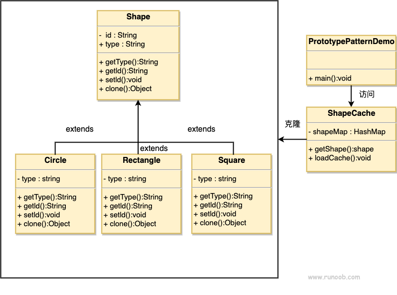

## 设计原则

-   单一职责：一个类或一个方法只负责一项职责
-   接口隔离：一个对象不应该依赖它不需要的接口(拆分接口)
-   依赖倒转：对象依赖抽象
-   里氏替换：在依赖父类的地方必须能透明地使用子类
-   开闭原则：对扩展开放，对修改关闭(外部可对对象进行扩展，但不允许修改)
-   迪米特原则：一个对象只拥有其他对象的最小知识
-   合成复用原则：使用组合或聚合而不是继承

## 设计模式

-   创建型：单例模式、原型模式、建造者模式、工厂模式
-   结构型：适配器模式、桥接模式、装饰模式、组合模式、外观模式、享元模式、代理模式
-   行为型：模板方法模式、命令模式、访问者模式、迭代器模式、观察者模式、中介者模式、备忘录模式、拦截器模式、状态模式、策略模式、责任链模式

## 创建型设计模式

### 单例模式

保证一个类的实例在整个系统中只存在一个

单例模式有以下写法

- 静态常量饿汉式
- 静态代码块饿汉式
- 懒汉式
- 同步方法懒汉式
- 双重检查锁
- 静态内部类
- 枚举

**饿汉式**

静态常量饿汉式

```java
public class Person {
    private static final Person instance = new Person();

    private Person() {}

    public static Person getInstance() {
        return instance;
    }
}
```

静态代码块饿汉式

```java
public class Person {
    private static final Person instance;
    
    static {
        instance = new Person();
    }
    
    private Person() {}
    
    public static Person getInstance() {
        return instance;
    }
}
```

优点：在类加载的时候就完成了对象创建，避免了线程同步问题

缺点：不是懒加载，可能造成内存浪费

**懒汉式**

一般懒汉式（线程不安全）

```java
public class Person {
    private static final Person instance;
    
    private Person() {}
    
    public static Person getInstance() {
        if (instance == null) {
            instance = new Person();
        }
        return instance;
    }
}
```

优点：实现了懒加载

缺点：线程不安全，当两个线程同时执行到`instance == null`，会同时判断为true

**同步方法懒汉式**

```java
public class Person {
    private static final Person instance;
    
    private Person() {}
    
    public static synchronized getInstance() {
        if (instance == null) {
            instance = new Person();
        }
        return instance;
    }
}
```

**双重检查锁**

使用`volatile`修饰instance，防止JVM对instance实例化操作进行指令重排，同时可以保证线程对instance的修改对其他线程可见

```java
public class Person {
    private static volatile Person instance;
    
    private Person() {}
    
    public static Person getInstance() {
        if (instance == null) {
            synchronized (Person.class) {
                if (instance == null) {
                    instance = new Person();
                }
            }
        }
        return instance;
    }
}
```

**静态内部类**

外部类进行类加载时，内部类不会同时进行类加载，只有在使用时才加载，同时类加载是线程安全的

```java
public class Person {
    private Person {}
    
    private static class PersonInstance {
        private static final Person INSTANCE = new Person();
    }
    
    public static Person getInstance() {
        return PersonInstance.INSTANCE;
    }
}
```

**枚举**

枚举是天然的单例模式

```java
enum Person {
    INSTANCE;
}
```

### 工厂模式

工厂模式用于根据参数或类型，创建不同的实体类对象，主要分为简单工厂模式、工厂方法模式和抽象工厂模式

**简单工厂模式**

定义以下实体类

```java
public interface Shape {
    void draw();
}

class Circle implements Shape {
    @Override
    public void draw() {
        System.out.println("Drawing a Circle.");
    }
}

class Rectangle implements Shape {
    @Override
    public void draw() {
        System.out.println("Drawing a Rectangle.");
    }
}

class Square implements Shape {
    @Override
    public void draw() {
        System.out.println("Drawing a Square.");
    }
}
```

实现工厂类

```java
public class ShapeFactory {
    public static Shape createShape(String shapeType) {
        if (shapeType == null || shapeType.isEmpty()) {
            return null;
        }
        switch (shapeType.toLowerCase()) {
            case "circle":
                return new Circle();
            case "rectangle":
                return new Rectangle();
            case "square":
                return new Square();
            default:
                throw new IllegalArgumentException("Unknown shape type: " + shapeType);
        }
    }
}
```

**工厂方法模式**

将简单工厂模式中的分支判断，转化为工厂类的多态

```java
interface Shape {
    void draw();
}

class Circle implements Shape {
    @Override
    public void draw() {
        System.out.println("Drawing a Circle.");
    }
}

class Rectangle implements Shape {
    @Override
    public void draw() {
        System.out.println("Drawing a Rectangle.");
    }
}

class Square implements Shape {
    @Override
    public void draw() {
        System.out.println("Drawing a Square.");
    }
}

// 工厂方法接口
interface ShapeFactory {
    Shape createShape();
}

class CircleFactory implements ShapeFactory {
    @Override
    public Shape createShape() {
        return new Circle();
    }
}

class RectangleFactory implements ShapeFactory {
    @Override
    public Shape createShape() {
        return new Rectangle();
    }
}

class SquareFactory implements ShapeFactory {
    @Override
    public Shape createShape() {
        return new Square();
    }
}
```

**抽象工厂模式**

```java
interface Shape {
    void draw();
}

class Circle2D implements Shape {
    @Override
    public void draw() {
        System.out.println("Drawing a 2D Circle.");
    }
}

class Rectangle2D implements Shape {
    @Override
    public void draw() {
        System.out.println("Drawing a 2D Rectangle.");
    }
}

class Circle3D implements Shape {
    @Override
    public void draw() {
        System.out.println("Drawing a 3D Circle.");
    }
}

class Rectangle3D implements Shape {
    @Override
    public void draw() {
        System.out.println("Drawing a 3D Rectangle.");
    }
}

// 抽象工厂接口
interface ShapeFactory {
    Shape createCircle();
    Shape createRectangle();
}

// 2D 工厂
class ShapeFactory2D implements ShapeFactory {
    @Override
    public Shape createCircle() {
        return new Circle2D();
    }

    @Override
    public Shape createRectangle() {
        return new Rectangle2D();
    }
}

// 3D 工厂
class ShapeFactory3D implements ShapeFactory {
    @Override
    public Shape createCircle() {
        return new Circle3D();
    }

    @Override
    public Shape createRectangle() {
        return new Rectangle3D();
    }
}
```

### 原型模式

原型模式用于创建重复的对象，减少构造器的调用，在实现上就是实现对象拷贝

对象拷贝分为浅拷贝和深拷贝，java中默认的`clone`方法实现了浅拷贝

深拷贝的两种实现方式

- 重写`clone`方法
- 对象序列化



### 建造者模式

建造者模式用于将复杂对象的构造过程与其表示分离，使得同样的构建过程可以创建不同的表示，常用于需要创建复杂对象的场景，例如对象由多个部件组成且构建过程需要按照一定步骤进行

建造者模式由实体类和建造者类组成，建造者类负责实体类的构造，如设置属性、验证等，实体类只能通过建造者类创建对象

```java
class Computer {
    private String CPU;
    private String GPU;
    private int RAM;
    private int storage;

    // 私有构造函数，避免直接实例化
    private Computer(ComputerBuilder builder) {
        this.CPU = builder.CPU;
        this.GPU = builder.GPU;
        this.RAM = builder.RAM;
        this.storage = builder.storage;
    }

    @Override
    public String toString() {
        return "Computer [CPU=" + 
            CPU + ", GPU=" + 
            GPU + ", RAM=" + 
            RAM + "GB, Storage=" + 
            storage + "GB]";
    }

    // 静态内部类，负责建造
    public static class ComputerBuilder {
        private String CPU;
        private String GPU;
        private int RAM;
        private int storage;

        // 提供流式方法设置各个属性
        public ComputerBuilder setCPU(String CPU) {
            this.CPU = CPU;
            return this;
        }

        public ComputerBuilder setGPU(String GPU) {
            this.GPU = GPU;
            return this;
        }

        public ComputerBuilder setRAM(int RAM) {
            this.RAM = RAM;
            return this;
        }

        public ComputerBuilder setStorage(int storage) {
            this.storage = storage;
            return this;
        }

        public Computer build() {
            return new Computer(this);
        }
    }
}
```

## 结构型设计模式

### 适配器模式


