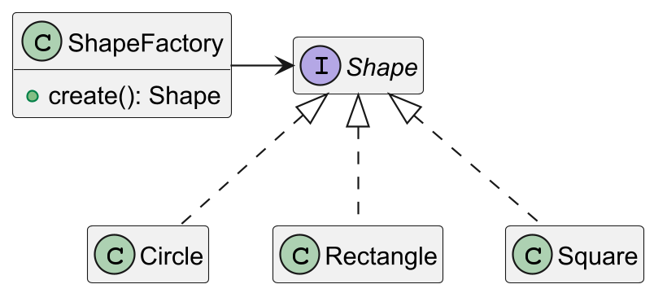
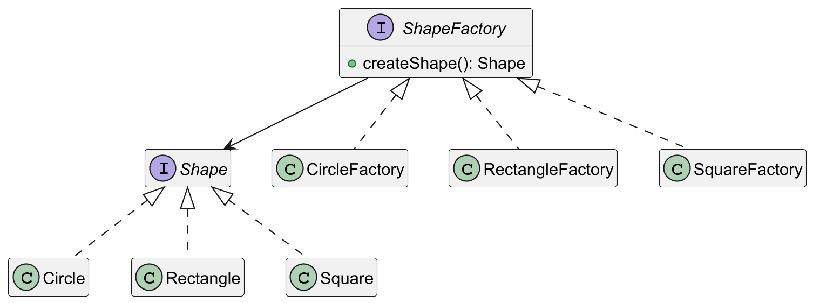
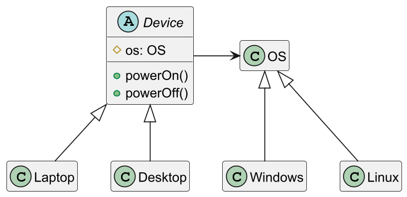

## 设计原则

-   单一职责：一个类或一个方法只负责一项职责
-   接口隔离：一个对象不应该依赖它不需要的接口(拆分接口)
-   依赖倒转：对象依赖抽象
-   里氏替换：在依赖父类的地方必须能透明地使用子类
-   开闭原则：对扩展开放，对修改关闭(外部可对对象进行扩展，但不允许修改)
-   迪米特原则：一个对象只拥有其他对象的最小知识
-   合成复用原则：使用组合或聚合而不是继承

## 设计模式

-   创建型：单例模式、原型模式、建造者模式、工厂模式
-   结构型：适配器模式、桥接模式、装饰模式、组合模式、外观模式、享元模式、代理模式
-   行为型：模板方法模式、命令模式、访问者模式、迭代器模式、观察者模式、中介者模式、备忘录模式、拦截器模式、状态模式、策略模式、责任链模式

## 创建型设计模式

### 单例模式

保证一个类的实例在整个系统中只存在一个

单例模式有以下写法

- 静态常量饿汉式
- 静态代码块饿汉式
- 懒汉式
- 同步方法懒汉式
- 双重检查锁
- 静态内部类
- 枚举

**饿汉式**

静态常量饿汉式

```java
public class Person {
    private static final Person instance = new Person();

    private Person() {}

    public static Person getInstance() {
        return instance;
    }
}
```

静态代码块饿汉式

```java
public class Person {
    private static final Person instance;
    
    static {
        instance = new Person();
    }
    
    private Person() {}
    
    public static Person getInstance() {
        return instance;
    }
}
```

优点：在类加载的时候就完成了对象创建，避免了线程同步问题

缺点：不是懒加载，可能造成内存浪费

**懒汉式**

一般懒汉式（线程不安全）

```java
public class Person {
    private static final Person instance;
    
    private Person() {}
    
    public static Person getInstance() {
        if (instance == null) {
            instance = new Person();
        }
        return instance;
    }
}
```

优点：实现了懒加载

缺点：线程不安全，当两个线程同时执行到`instance == null`，会同时判断为true

**同步方法懒汉式**

```java
public class Person {
    private static final Person instance;
    
    private Person() {}
    
    public static synchronized getInstance() {
        if (instance == null) {
            instance = new Person();
        }
        return instance;
    }
}
```

**双重检查锁**

使用`volatile`修饰instance，防止JVM对instance实例化操作进行指令重排，同时可以保证线程对instance的修改对其他线程可见

```java
public class Person {
    private static volatile Person instance;
    
    private Person() {}
    
    public static Person getInstance() {
        if (instance == null) {
            synchronized (Person.class) {
                if (instance == null) {
                    instance = new Person();
                }
            }
        }
        return instance;
    }
}
```

**静态内部类**

外部类进行类加载时，内部类不会同时进行类加载，只有在使用时才加载，同时类加载是线程安全的

```java
public class Person {
    private Person {}
    
    private static class PersonInstance {
        private static final Person INSTANCE = new Person();
    }
    
    public static Person getInstance() {
        return PersonInstance.INSTANCE;
    }
}
```

**枚举**

枚举是天然的单例模式

```java
enum Person {
    INSTANCE;
}
```

### 工厂模式

工厂模式用于根据参数或类型，创建不同的实体类对象，主要分为简单工厂模式、工厂方法模式和抽象工厂模式

**简单工厂模式**



```java
public interface Shape {
    void draw();
}

class Circle implements Shape {
    @Override
    public void draw() {
        System.out.println("Drawing a Circle.");
    }
}

class Rectangle implements Shape {
    @Override
    public void draw() {
        System.out.println("Drawing a Rectangle.");
    }
}

class Square implements Shape {
    @Override
    public void draw() {
        System.out.println("Drawing a Square.");
    }
}

public class ShapeFactory {
    public static Shape createShape(String shapeType) {
        if (shapeType == null || shapeType.isEmpty()) {
            return null;
        }
        switch (shapeType.toLowerCase()) {
            case "circle":
                return new Circle();
            case "rectangle":
                return new Rectangle();
            case "square":
                return new Square();
            default:
                throw new IllegalArgumentException("Unknown shape type: " + shapeType);
        }
    }
}
```

**工厂方法模式**

将简单工厂模式中的分支判断，转化为工厂类的多态



```java
interface Shape {
    void draw();
}

class Circle implements Shape {
    @Override
    public void draw() {
        System.out.println("Drawing a Circle.");
    }
}

class Rectangle implements Shape {
    @Override
    public void draw() {
        System.out.println("Drawing a Rectangle.");
    }
}

class Square implements Shape {
    @Override
    public void draw() {
        System.out.println("Drawing a Square.");
    }
}

// 工厂方法接口
interface ShapeFactory {
    Shape createShape();
}

class CircleFactory implements ShapeFactory {
    @Override
    public Shape createShape() {
        return new Circle();
    }
}

class RectangleFactory implements ShapeFactory {
    @Override
    public Shape createShape() {
        return new Rectangle();
    }
}

class SquareFactory implements ShapeFactory {
    @Override
    public Shape createShape() {
        return new Square();
    }
}
```

**抽象工厂模式**

```java
interface Shape {
    void draw();
}

class Circle2D implements Shape {
    @Override
    public void draw() {
        System.out.println("Drawing a 2D Circle.");
    }
}

class Rectangle2D implements Shape {
    @Override
    public void draw() {
        System.out.println("Drawing a 2D Rectangle.");
    }
}

class Circle3D implements Shape {
    @Override
    public void draw() {
        System.out.println("Drawing a 3D Circle.");
    }
}

class Rectangle3D implements Shape {
    @Override
    public void draw() {
        System.out.println("Drawing a 3D Rectangle.");
    }
}

// 抽象工厂接口
interface ShapeFactory {
    Shape createCircle();
    Shape createRectangle();
}

// 2D 工厂
class ShapeFactory2D implements ShapeFactory {
    @Override
    public Shape createCircle() {
        return new Circle2D();
    }

    @Override
    public Shape createRectangle() {
        return new Rectangle2D();
    }
}

// 3D 工厂
class ShapeFactory3D implements ShapeFactory {
    @Override
    public Shape createCircle() {
        return new Circle3D();
    }

    @Override
    public Shape createRectangle() {
        return new Rectangle3D();
    }
}
```

### 原型模式

原型模式用于创建重复的对象，减少构造器的调用，在实现上就是实现对象拷贝

对象拷贝分为浅拷贝和深拷贝，java中默认的`clone`方法实现了浅拷贝

深拷贝的两种实现方式

- 重写`clone`方法
- 对象序列化

### 建造者模式

建造者模式用于将复杂对象的构造过程与其表示分离，使得同样的构建过程可以创建不同的表示，常用于需要创建复杂对象的场景，例如对象由多个部件组成且构建过程需要按照一定步骤进行

建造者模式由实体类和建造者类组成，建造者类负责实体类的构造，如设置属性、验证等，实体类只能通过建造者类创建对象

```java
class Computer {
    private String CPU;
    private String GPU;
    private int RAM;
    private int storage;

    // 私有构造函数，避免直接实例化
    private Computer(ComputerBuilder builder) {
        this.CPU = builder.CPU;
        this.GPU = builder.GPU;
        this.RAM = builder.RAM;
        this.storage = builder.storage;
    }

    @Override
    public String toString() {
        return "Computer [CPU=" + 
            CPU + ", GPU=" + 
            GPU + ", RAM=" + 
            RAM + "GB, Storage=" + 
            storage + "GB]";
    }

    // 静态内部类，负责建造
    public static class ComputerBuilder {
        private String CPU;
        private String GPU;
        private int RAM;
        private int storage;

        // 提供流式方法设置各个属性
        public ComputerBuilder setCPU(String CPU) {
            this.CPU = CPU;
            return this;
        }

        public ComputerBuilder setGPU(String GPU) {
            this.GPU = GPU;
            return this;
        }

        public ComputerBuilder setRAM(int RAM) {
            this.RAM = RAM;
            return this;
        }

        public ComputerBuilder setStorage(int storage) {
            this.storage = storage;
            return this;
        }

        public Computer build() {
            return new Computer(this);
        }
    }
}
```

## 结构型设计模式

### 适配器模式

适配器模式通过引入一个适配器类，将一个类的接口转换为客户端期望的另一个接口，使得原本由于接口不兼容而无法一起工作的类可以协同工作，保证了兼容性

适用场景

1. 接口不兼容：当需要使用一个现有类，但其接口不符合目标接口时，可以使用适配器。
2. 复用现有功能：在不改变已有类的基础上，通过适配器提供一个新的接口以复用其功能。
3. 第三方集成：需要将现有系统与第三方库结合，而第三方接口与系统接口不兼容时。

适配器模式分为三类

- 类适配器
- 对象适配器
- 接口适配器

**类适配器**


```java
// 目标接口
interface Target {
    void request();
}

// 被适配类
class Adaptee {
    public void specificRequest() {
        System.out.println("Adaptee: specificRequest executed");
    }
}

// 适配器类
class ClassAdapter extends Adaptee implements Target {
    @Override
    public void request() {
        System.out.println("ClassAdapter: Translating request");
        specificRequest(); // 调用被适配者的方法
    }
}
```

**对象适配器**


```java
// 目标接口
interface Target {
    void request();
}

// 被适配类
class Adaptee {
    public void specificRequest() {
        System.out.println("Adaptee: specificRequest executed");
    }
}

// 对象适配器类
class ObjectAdapter implements Target {
    private Adaptee adaptee; // 以组合代替继承，组合一个Adaptee对象

    // 构造方法注入被适配者对象
    public ObjectAdapter(Adaptee adaptee) {
        this.adaptee = adaptee;
    }

    @Override
    public void request() {
        System.out.println("ObjectAdapter: Translating request");
        adaptee.specificRequest(); // 调用被适配者的方法
    }
}
```

**接口适配器**

接口适配器通常用于接口有多个方法时，子类并不需要实现所有的方法，这是通过创建一个抽象类提供默认实现（空实现）来实现的，子类可以根据需要重写特定的方法

```java
// 目标接口，定义多个方法
interface Target {
    void method1();
    void method2();
    void method3();
}

// 接口适配器类，提供默认实现（空实现）
abstract class TargetAdapter implements Target {
    @Override
    public void method1() {
        // 默认实现（空方法）
    }

    @Override
    public void method2() {
        // 默认实现（空方法）
    }

    @Override
    public void method3() {
        // 默认实现（空方法）
    }
}

// 子类根据需要重写特定的方法
class ConcreteAdapter extends TargetAdapter {
    @Override
    public void method1() {
        System.out.println("ConcreteAdapter: method1 executed");
    }
}
```

### 桥接模式

桥接模式通过将抽象部分与实现部分分离，使它们可以独立变化，桥接模式使用组合来代替继承，从而降低抽象和实现之间的耦合度

适用场景

1. 功能扩展：一个类需要在多个维度上扩展（例如设备和平台），但这些维度彼此独立。
2. 避免类膨胀：如果使用继承来扩展维度，可能会导致大量子类。
3. 运行时切换实现：需要在运行时动态切换抽象部分的实现部分。



```java
// 实现接口（Implementor）
interface OS {
    void start();
    void shutDown();
}

// 具体实现类（Concrete Implementor）
class Windows implements OS {
    @Override
    public void start() {
        System.out.println("Windows is starting...");
    }

    @Override
    public void shutDown() {
        System.out.println("Windows is shutting down...");
    }
}

class Linux implements OS {
    @Override
    public void start() {
        System.out.println("Linux is starting...");
    }

    @Override
    public void shutDown() {
        System.out.println("Linux is shutting down...");
    }
}

// 抽象类（Abstraction）
abstract class Device {
    protected OS os; // 桥接到实现部分

    public Device(OS os) {
        this.os = os;
    }

    public abstract void powerOn();

    public abstract void powerOff();
}

// 扩充抽象类（Refined Abstraction）
class Laptop extends Device {
    public Laptop(OS os) {
        super(os);
    }

    @Override
    public void powerOn() {
        System.out.println("Laptop powering on...");
        os.start();
    }

    @Override
    public void powerOff() {
        System.out.println("Laptop powering off...");
        os.shutDown();
    }
}

class Desktop extends Device {
    public Desktop(OS os) {
        super(os);
    }

    @Override
    public void powerOn() {
        System.out.println("Desktop powering on...");
        os.start();
    }

    @Override
    public void powerOff() {
        System.out.println("Desktop powering off...");
        os.shutDown();
    }
}

// 客户端
public class Client {
    public static void main(String[] args) {
        OS windows = new Windows();
        OS linux = new Linux();

        Device laptop = new Laptop(windows);
        laptop.powerOn();
        laptop.powerOff();

        Device desktop = new Desktop(linux);
        desktop.powerOn();
        desktop.powerOff();
    }
}
```

### 装饰者模式

装饰者模式通过将对象放入一系列装饰器类中，从而动态地为对象添加功能，而无需修改原始类的定义，装饰者模式可以看作是对继承的一种灵活替代

适用场景

1. 动态扩展功能：需要为对象动态添加行为，而不是通过子类静态扩展。
2. 功能的逐步增强：希望通过组合方式来逐步增强对象的功能。
3. 避免类爆炸：使用继承扩展功能时，会产生大量子类，使用装饰者模式可避免这一问题。


```java
// 抽象组件
interface Beverage {
    String getDescription();
    double getCost();
}

// 具体组件
class SimpleCoffee implements Beverage {
    @Override
    public String getDescription() {
        return "Simple Coffee";
    }

    @Override
    public double getCost() {
        return 5.0;
    }
}

// 抽象装饰者
abstract class BeverageDecorator implements Beverage {
    protected Beverage beverage; // 持有对组件的引用

    public BeverageDecorator(Beverage beverage) {
        this.beverage = beverage;
    }

    @Override
    public String getDescription() {
        return beverage.getDescription();
    }

    @Override
    public double getCost() {
        return beverage.getCost();
    }
}

// 具体装饰者1：添加牛奶
class MilkDecorator extends BeverageDecorator {
    public MilkDecorator(Beverage beverage) {
        super(beverage);
    }

    @Override
    public String getDescription() {
        return beverage.getDescription() + ", Milk";
    }

    @Override
    public double getCost() {
        return beverage.getCost() + 1.5;
    }
}

// 具体装饰者2：添加糖
class SugarDecorator extends BeverageDecorator {
    public SugarDecorator(Beverage beverage) {
        super(beverage);
    }

    @Override
    public String getDescription() {
        return beverage.getDescription() + ", Sugar";
    }

    @Override
    public double getCost() {
        return beverage.getCost() + 0.5;
    }
}

// 客户端
public class Client {
    public static void main(String[] args) {
        // 创建基础咖啡
        Beverage coffee = new SimpleCoffee();

        // 添加牛奶装饰
        coffee = new MilkDecorator(coffee);

        // 添加糖装饰
        coffee = new SugarDecorator(coffee);

        System.out.println("Order: " + coffee.getDescription());
        System.out.println("Cost: $" + coffee.getCost());
    }
}
```

### 组合模式

组合模式将对象组织成树形结构以表示“部分-整体”的层次结构，它使得客户端可以以一致的方式处理单个对象和组合对象，而不需要关心它们的具体类型

适用场景

1. 部分-整体结构：需要表示对象与对象集合的层次关系。
2. 统一处理：希望客户端能够一致地对待单个对象和组合对象。
3. 递归调用：在树形结构中，对节点和叶子节点的操作具有一致性。


```java
// 抽象组件
interface FileSystem {
    void display(String indent);
}

// 叶子节点
class File implements FileSystem {
    private String name;

    public File(String name) {
        this.name = name;
    }

    @Override
    public void display(String indent) {
        System.out.println(indent + "- File: " + name);
    }
}

// 容器节点
class Folder implements FileSystem {
    private String name;
    private List<FileSystem> children = new ArrayList<>();

    public Folder(String name) {
        this.name = name;
    }

    public void add(FileSystem component) {
        children.add(component);
    }

    public void remove(FileSystem component) {
        children.remove(component);
    }

    @Override
    public void display(String indent) {
        System.out.println(indent + "+ Folder: " + name);
        for (FileSystem child : children) {
            child.display(indent + "  ");
        }
    }
}

// 客户端
public class Client {
    public static void main(String[] args) {
        // 创建文件和文件夹
        File file1 = new File("file1.txt");
        File file2 = new File("file2.txt");
        File file3 = new File("file3.txt");

        Folder folder1 = new Folder("Folder1");
        Folder folder2 = new Folder("Folder2");

        // 组织层次结构
        folder1.add(file1);
        folder1.add(file2);

        folder2.add(file3);
        folder2.add(folder1);

        // 打印文件系统
        folder2.display("");
    }
}
```

### 外观模式

外观模式为子系统中的一组接口提供一个统一的接口，它定义了一个高层接口，使得子系统更容易使用，从而简化了客户端与复杂子系统之间的交互

适用场景

1. 简化复杂系统：子系统包含多个复杂的接口，使用外观模式简化客户端的调用。
2. 统一入口：需要提供一个统一的接口屏蔽子系统的复杂性。
3. 解耦客户端与子系统：客户端不需要直接依赖子系统，可以降低耦合性。


```java
// 子系统1：电视
class Television {
    public void turnOn() {
        System.out.println("Television is turned on.");
    }

    public void turnOff() {
        System.out.println("Television is turned off.");
    }
}

// 子系统2：音响
class SoundSystem {
    public void setVolume(int level) {
        System.out.println("Sound system volume set to " + level + ".");
    }

    public void turnOn() {
        System.out.println("Sound system is turned on.");
    }

    public void turnOff() {
        System.out.println("Sound system is turned off.");
    }
}

// 子系统3：投影仪
class Projector {
    public void lowerScreen() {
        System.out.println("Projector screen lowered.");
    }

    public void raiseScreen() {
        System.out.println("Projector screen raised.");
    }

    public void turnOn() {
        System.out.println("Projector is turned on.");
    }

    public void turnOff() {
        System.out.println("Projector is turned off.");
    }
}

// 外观类
class HomeTheaterFacade {
    private Television tv;
    private SoundSystem sound;
    private Projector projector;

    public HomeTheaterFacade(Television tv, SoundSystem sound, Projector projector) {
        this.tv = tv;
        this.sound = sound;
        this.projector = projector;
    }

    public void watchMovie() {
        System.out.println("Preparing to watch a movie...");
        projector.lowerScreen();
        projector.turnOn();
        tv.turnOn();
        sound.turnOn();
        sound.setVolume(10);
        System.out.println("Movie is ready to play. Enjoy!");
    }

    public void endMovie() {
        System.out.println("Shutting down movie...");
        projector.raiseScreen();
        projector.turnOff();
        tv.turnOff();
        sound.turnOff();
        System.out.println("Movie ended. Goodbye!");
    }
}

// 客户端
public class Client {
    public static void main(String[] args) {
        // 创建子系统组件
        Television tv = new Television();
        SoundSystem sound = new SoundSystem();
        Projector projector = new Projector();

        // 创建外观类
        HomeTheaterFacade homeTheater = new HomeTheaterFacade(tv, sound, projector);

        // 使用外观类操作
        homeTheater.watchMovie();
        System.out.println();
        homeTheater.endMovie();
    }
}
```

### 享元模式

享元模式通过共享相同或相似对象，减少内存消耗，提高性能，它使用共享技术有效支持大量细粒度对象的复用，以避免因大量对象创建带来的资源浪费

适用场景

1. 大量相似对象：系统需要生成大量细粒度的对象，导致内存消耗过大。
2. 对象内部状态可以拆分：对象有可以共享的部分和依赖外部变化的部分。
3. 需要缓存共享对象：需要使用池化技术来管理对象实例。


```java
// 抽象享元
interface ChessPiece {
    void display(Position position);
}

// 具体享元
class ConcreteChessPiece implements ChessPiece {
    private final String color; // 内部状态（共享）

    public ConcreteChessPiece(String color) {
        this.color = color;
    }

    @Override
    public void display(Position position) {
        System.out.println("Chess piece color: " + color + ", Position: " + position.getX() + ", " + position.getY());
    }
}

// 享元工厂
class ChessPieceFactory {
    private static final Map<String, ChessPiece> chessPieces = new HashMap<>();

    public static ChessPiece getChessPiece(String color) {
        ChessPiece piece = chessPieces.get(color);
        if (piece == null) {
            piece = new ConcreteChessPiece(color);
            chessPieces.put(color, piece);
            System.out.println("Creating new chess piece of color: " + color);
        }
        return piece;
    }
}

// 外部状态
class Position {
    private final int x; // 横坐标
    private final int y; // 纵坐标

    public Position(int x, int y) {
        this.x = x;
        this.y = y;
    }

    public int getX() {
        return x;
    }

    public int getY() {
        return y;
    }
}

// 客户端
public class Client {
    public static void main(String[] args) {
        ChessPiece black1 = ChessPieceFactory.getChessPiece("Black");
        black1.display(new Position(1, 1));

        ChessPiece black2 = ChessPieceFactory.getChessPiece("Black");
        black2.display(new Position(2, 2));

        ChessPiece white1 = ChessPieceFactory.getChessPiece("White");
        white1.display(new Position(3, 3));

        ChessPiece black3 = ChessPieceFactory.getChessPiece("Black");
        black3.display(new Position(4, 4));
    }
}
```

