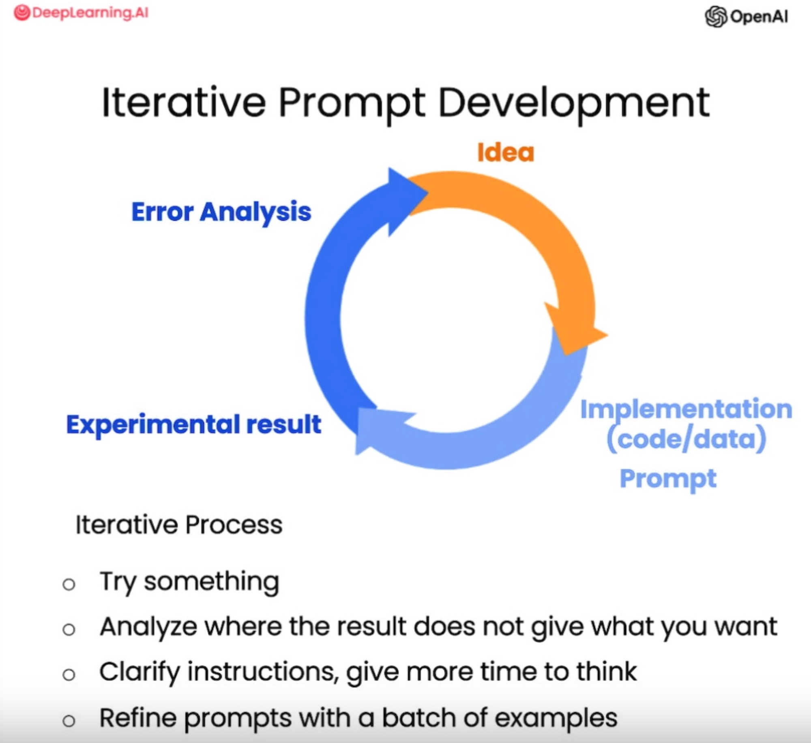

## 提示词设计原则

在LLM开发中，通常将LLM的输入称为Prompt，将LLM的输出称为Completion

提示词（Prompt）设计的两个关键原则

- 编写清晰、具体的指令
- 给予模型充足的思考时间

### 编写清晰、具体的指令

通常，使用更长、更复杂的prompt会取得更好的效果，因为复杂的prompt中包含了更丰富的上下文信息

在编写prompt时，有以下编写技巧

- 使用分隔符清晰地表示输入的不同部分

  可以使用任何标点符号作为分隔符来分隔输入的不同部分，如````,"""`等

  使用分隔符还可以防止**提示词注入**，即用户的输入内容与prompt模板发生冲突，导致模型产生不好的输出

- 要求模型输出结构化的内容

  可以要求模型生成json、html等格式的内容，便于后续处理

- 要求模型检查是否满足条件

  如果任务包含不一定能满足的假设（条件），我们可以告诉模型先检查这些假设，如果不满足，则会指出并停止执行后续的完整流程。您还可以考虑可能出现的边缘情况及模型的应对，以避免意外的结果或错误发生

- 提供少量示例

  也称为**少样本提示（Few-shot Prompting）**，在要求模型执行实际任务之前，给模型一两个已完成的样例，让模型了解我们的要求和期望的输出样式

### 给予模型充足的思考时间

可以通过prompt来引导模型进行深入思考，要求其先列出对问题的各种看法，说明推理依据，然后再得出最终结论。在 prompt中添加逐步推理的要求，能让语言模型投入更多时间逻辑思维，输出结果也将更可靠准确

可以使用以下技巧引导模型深入思考

- 指定完成任务所需的步骤

  对于一个复杂任务，可以给模型指定完成任务需要的步骤，要求模型严格按照步骤执行

- 指导模型在给出结论之前自主思考解法

  在prompt中先要求模型自己尝试解决这个问题，思考出自己的解法，然后再与提供的解答进行对比，判断正确性，这种先让语言模型自主思考的方式，能帮助它更深入理解问题，做出更准确的判断

  e.g.

  ```python
  prompt = f"""
  请判断学生的解决方案是否正确，请通过如下步骤解决这个问题：
  
  步骤：
  
      首先，自己解决问题。
      然后将您的解决方案与学生的解决方案进行比较，对比计算得到的总费用与学生计算的总费用是否一致，并评估学生的解决方案是否正确。
      在自己完成问题之前，请勿决定学生的解决方案是否正确。
  
  使用以下格式：
  
      问题：问题文本
      学生的解决方案：学生的解决方案文本
      实际解决方案和步骤：实际解决方案和步骤文本
      学生计算的总费用：学生计算得到的总费用
      实际计算的总费用：实际计算出的总费用
      学生计算的费用和实际计算的费用是否相同：是或否
      学生的解决方案和实际解决方案是否相同：是或否
      学生的成绩：正确或不正确
  
  问题：
  
      我正在建造一个太阳能发电站，需要帮助计算财务。 
      - 土地费用为每平方英尺100美元
      - 我可以以每平方英尺250美元的价格购买太阳能电池板
      - 我已经谈判好了维护合同，每年需要支付固定的10万美元，并额外支付每平方英尺10美元;
  
      作为平方英尺数的函数，首年运营的总费用是多少。
  
  学生的解决方案：
  
      设x为发电站的大小，单位为平方英尺。
      费用：
      1. 土地费用：100x美元
      2. 太阳能电池板费用：250x美元
      3. 维护费用：100,000+100x=10万美元+10x美元
      总费用：100x美元+250x美元+10万美元+100x美元=450x+10万美元
  
  实际解决方案和步骤：
  """
  response = get_completion(prompt)
  print(response)
  ```

## 迭代优化

通常在设计prompt时，很难一次设计出效果好的prompt，此时需要对prompt进行迭代优化

- 在prompt中添加长度限制以控制生成内容的长度，生成内容长度并不严格等于限制长度
- 检查是否捕捉到正确的细节，逐步优化prompt，使语言模型生成的文本更加符合预期的样式和内容要求



## LLM功能

### 基本功能

利用LLM的零样本能力，设计prompt，LLM可以轻易地完成以下基本功能

> 零样本能力：指LLM在未经特定任务训练或微调的情况下，直接利用预训练阶段积累的知识完成任务的能力。例如，模型无需情感分析训练数据，即可通过理解文本上下文判断情感倾向
{: .prompt-tip }

- 文本概括和提取
- 推断
  - 情感推断
  - 信息提取
  - 主题推断
- 文本转换
  - 文本翻译
  - 语气与写作风格调整
  - 文本格式转换
  - 拼写及语法纠正

### 文本扩展

LLM中的temperature温度参数可以控制模型生成内容的随机性，temperature取值为0到1，temperature值越大，模型更倾向于输出更随机的文本，temperature值越小，模型更倾向于输出高概率文本

### 聊天机器人

在多轮对话中，包含不同的角色，通常设置三种角色，分别是System、User、Assistant，在多轮对话的消息列表中，通常以System消息作为第一条消息，之后的消息在User和Assistant之间交替

- System：System消息给模型提供一个总体的指示来引导模型，优先级比User消息高
- User消息：用户输入
- Assistant消息：模型输出

与LLM的每次交互都是独立的，因此有时我们需要给LLM提供一些信息，以便LLM在生成completion时能够引用，这些信息称为**上下文（Context）**，上下文可能是我们提供给LLM的背景信息，也可能是过去与LLM交互的对话

```python
messages =  [  
{'role':'system', 'content':'你是个友好的聊天机器人。'},
{'role':'user', 'content':'Hi, 我是Isa'},
{'role':'assistant', 'content': "Hi Isa! 很高兴认识你。今天有什么可以帮到你的吗?"},
{'role':'user', 'content':'是的，你可以提醒我, 我的名字是什么?'}  ]
response = get_completion_from_messages(messages, temperature=1)
print(response)  # 当然可以！您的名字是Isa。
```

