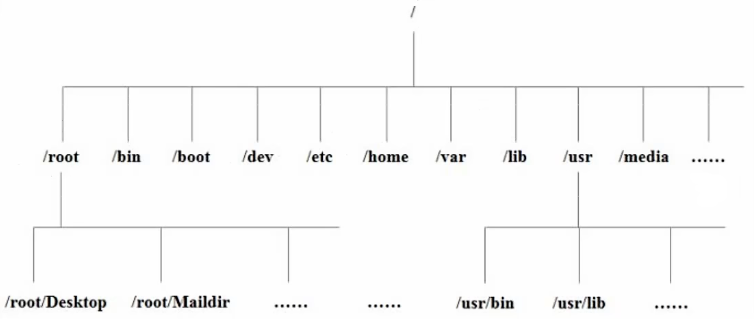

## 文件目录结构

Linux使用层次结构



Linux根目录为/，常见的系统目录如下

| 目录  | 描述                                     |
| ----- | ---------------------------------------- |
| bin   | 存放指令的二进制机器码                   |
| sbin  | 系统指令的二进制机器码，使用权限为管理员 |
| lib   | 存储库文件                               |
| usr   | 存放用户的所有应用程序                   |
| boot  | 存放系统启动时的配置文件                 |
| dev   | 存放硬件设备的映射文件                   |
| etc   | 存放系统管理的配置文件                   |
| home  | 存放用户的主文件夹                       |
| root  | root用户的主文件夹                       |
| opt   | 存放第三方软件                           |
| media | 可移动媒体的分区挂载到该目录下           |
| mnt   | 可移动媒体的挂载点                       |
| proc  | 存放系统进程的映射                       |
| run   | 存放当前系统信息，重启后重置             |
| srv   | 存放各种服务                             |
| tmp   | 存放临时文件                             |
| var   | 存放经常修改的文件，如日志               |

## 挂载

在Linux中，挂载是将存储设备（如硬盘分区、USB驱动器、光盘等）与文件系统连接的过程。通过挂载，用户可以在一个指定的目录中访问这些设备中的文件和目录，从而实现不同文件系统的混合使用

### 工作原理

1.  挂载点：挂载点是一个目录，用于访问挂载的设备。当设备被挂载时，它的内容将出现在这个目录下，例如，如果将USB驱动器挂载到`/media/usb`，你可以在该目录下访问USB驱动器中的文件
2.  设备文件：在Linux中，每个硬件设备都有一个对应的设备文件，通常位于`/dev`目录下，通过这些设备文件，系统能够与硬件进行交互
3.  文件系统类型：不同的存储设备可以使用不同类型的文件系统（如ext4、NTFS、FAT32等）。挂载时，系统需要知道要挂载的文件系统类型，以便正确处理文件和目录

### 相关命令

-   `mount [OPTIONS] <device-path> <mount-path>`：将设备挂载到挂载点
-   `df`：查看已挂载的文件系统
-   `umount <mount-path>`：卸载文件系统

## 权限控制

文件权限控制是Linux系统中重要的安全机制，它决定了哪些用户或用户组可以访问或操作特定文件和目录。Linux的文件权限系统基于所有者、用户组和其他用户的分类，确保只有授权的用户可以执行特定操作

### 权限组成

Linux中的所有文件或目录都有三种权限

-   读权限(r)：允许用户查看
-   写权限(w)：允许用户增删改
-   执行权限(x)：允许用户执行文件或进入目录

### 权限字符串

文件的权限使用一个字符串表示，使用`ls -l`查看当前目录中文件的权限信息

```
-rxwrxwrxw
```

权限字符串中包含10个字符

-   第一个字符表示文件的类型，`-`表示文件，`d`表示目录，`l`表示链接文件
-   第一组rwx表示文件所有者的权限
-   第二组rwx表示文件所有者所在的用户组的权限
-   第三组rwx表示除了所有者和用户组的其他用户的权限

### 相关命令

-   `chmod [MODE] <filename>`：修改文件权限

    MODE有两种形式

    -   符号形式

        使用`u`表示所有者，`g`表示用户组，`o`表示其他用户，`a`表示所有用户，使用`+/-`增加或删除权限

        ```bash
        # 所有者增加执行权限
        chmod u+x filename
        
        # 用户组删除写权限
        chmod g-w filename
        ```

    -   八进制形式

        将rwx看做一个二进制串，从而对应到一个八进制数，例如，`rw-`对应`110`，对应到数字6

        使用八进制模式可以整体设置权限

        ```bash
        # 所有者权限为rwx，用户组权限为r-x，其他用户权限为r--
        chmod 754 filename
        ```

-   `chown [USER:GROUP] <filename>`：修改文件的所有者和用户组

    ```bash
    chown user:group filename
    ```

    

