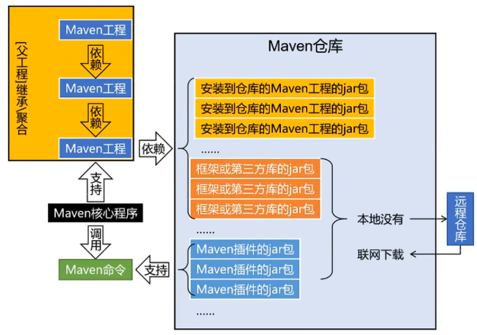

## 开始

Maven是一个强大的**项目构建和依赖管理工具**，主要用于Java项目。它提供了一种标准化的项目结构和构建方式，能够自动管理项目的依赖库、编译、打包、测试和发布等任务

## 仓库

Maven的仓库是用于存储项目依赖包的存储库。仓库中的依赖可以被项目下载、缓存和复用，确保项目构建时所需的所有依赖项都能按需获取

Maven仓库分为三类

- 本地仓库：本地仓库是存储在开发者电脑中的一个目录，默认位置位于`~/.m2/repository`，每当Maven构建项目时，它首先会检查本地仓库中是否已经存在该依赖包，如果存在则直接使用，避免重复下载
- 远程仓库
  - 中央仓库：中央仓库是由Maven官方提供的公共仓库，包含了大量的开源库和第三方依赖，是Maven的默认远程仓库，地址为[Maven Repository](https://mvnrepository.com/)
  - 自定义仓库：通常用于存储中央仓库中找不到的特殊依赖包。企业级开发中，往往会使用远程仓库来管理公司内部开发的私有组件或外部库，这些仓库可以托管在公司服务器上或者使用第三方提供的仓库管理服务（如`Nexus`或`Artifactory`）

## 工作机制

Maven的工作机制如下图所示



- Maven项目结构

  图的左侧显示了Maven项目的依赖关系。多个Maven项目之间可以通过继承、聚合形成父子结构，在这些项目中，一个项目可能依赖于其他项目的功能或库

- Maven核心程序和命令的支持

  Maven的核心程序负责调用各种Maven命令，以便进行构建、测试和依赖管理等操作。用户通过命令调用Maven 的功能，这些命令会触发Maven来处理项目的构建和依赖下载

- 依赖管理

  - 当一个Maven项目声明了依赖关系，Maven会首先检查本地仓库中是否存在所需的依赖项。如果存在，则直接从本地仓库获取
  - 如果本地仓库没有该依赖项，则Maven会连接远程仓库下载相应的依赖项，并将其缓存到本地仓库中，以便下次可以直接使用

- Maven仓库

  图中的右侧显示了Maven仓库的结构，仓库分为本地和远程两个部分

  - 本地仓库：存储已安装的项目JAR包、框架或第三方库的JAR包以及Maven插件的JAR包
  - 远程仓库：在本地仓库中没有找到某个依赖项时，Maven会从远程仓库下载所需的JAR包

## Maven工程

maven主命令：mvn

创建maven java工程：`mvn archetype:generate`

archetype是maven插件名，generate是目标

>   Java工程和Web工程的区别：Java工程是CS架构，是面向桌面应用的，由main方法开始，只依赖JVM编译运行，通常是本地的。Web工程是BS架构，需要部署到服务器上，由Tomcat服务器触发，通常是远程的

### 坐标

maven中使用三个值唯一确定一个jar包

-   groupId：组织或公司域名的倒序，在最后加上项目名称
-   artifactId：模块名称，作为maven的工程名
-   version：版本号

### pom.xml

`pom.xml`是maven工程的配置文件

-   modelVersion：表示当前pom.xml采用的标签结构，固定值为4.0.0
-   gourpId
-   artifactId
-   version
-   packaging：表示打包方式
    -   jar：打包成jar包，说明该工程是一个java工程
    -   war：打包成war包，说明该工程是一个web工程
    -   pom：说明当前工程用于管理其他工程
-   properties：定义maven属性
-   dependencies：配置依赖信息
    -   dependency：配置一个具体的依赖，依赖中通过坐标指定依赖的jar包，scope配置当前依赖的作用域

>   POM：POM是项目对象模型

### java工程目录结构

```
my-app                  # 项目根目录
├── pom.xml             # Maven 的项目配置文件
└── src                 # 源代码目录
    ├── main            # 主程序代码
    │   ├── java        # Java 源代码
    │   │   └── com
    │   │       └── example
    │   │           └── myapp
    │   │               └── App.java       # 主程序代码示例
    │   └── resources   # 资源文件 (如配置文件、XML、属性文件等)
    │       └── application.properties
    └── test            # 测试代码
        ├── java        # Java 测试代码
        │   └── com
        │       └── example
        │           └── myapp
        │               └── AppTest.java  # 测试代码示例
        └── resources   # 测试资源文件
```

### web工程目录结构

```
my-web-app                   # 项目根目录
├── pom.xml                  # Maven 的项目配置文件
└── src                      # 源代码目录
    ├── main                 # 主程序代码和资源
    │   ├── java             # Java 源代码
    │   │   └── com
    │   │       └── example
    │   │           └── mywebapp
    │   │               └── App.java        # 主程序代码示例
    │   ├── resources        # 资源文件（如配置文件、属性文件等）
    │   │   └── application.properties
    │   └── webapp           # Web 应用资源目录
    │       ├── WEB-INF      # Web 应用配置目录
    │       │   ├── web.xml  # Web 应用的核心配置文件
    │       │   └── classes  # 可选：存放编译后的类文件或配置
    │       ├── META-INF     # 可选：用于存放应用的元数据
    │       ├── index.jsp    # JSP 文件示例
    │       ├── css          # CSS 文件目录
    │       │   └── style.css
    │       ├── js           # JavaScript 文件目录
    │       │   └── script.js
    │       └── images       # 图像资源目录
    │           └── logo.png
    └── test                 # 测试代码和资源
        ├── java             # Java 测试代码
        │   └── com
        │       └── example
        │           └── mywebapp
        │               └── AppTest.java   # 测试代码示例
        └── resources        # 测试资源文件
```

> web工程中的jar包其实就是java工程，因此web工程可以依赖多个java工程，而java工程不能依赖web工程，web工程依赖的java工程存放在`WEB-INF/lib`目录下
{: prompt-info}

### maven命令

- `mvn compile`：编译，编译结果放在target目录下

- `mvn test-compile`：编译测试

- `mvn clean`：清理编译结果

- `mvn test`：测试，测试时会进行编译，生成target目录，该目录下的`surefire-reports`文件夹存放测试报告

- `mvn package`：打包，打包后的jar/war包存放在target目录下

- `mvn install`：安装，将jar/war包安装到本地Maven仓库中，安装操作同时会将工程的pom.xml也安装到仓库中，对应.pom文件

## 依赖管理

### 依赖作用域

在pom.xml中配置scope标签的取值

可选值

-   compile：默认作用域，适用于编译、测试和运行阶段，即无论是编译代码还是运行应用时，都可以使用这些依赖
-   test：表示该依赖仅用于测试代码，编译和运行应用程序时不会包含这些依赖
-   provided：表示编译时需要该依赖，但运行时不需要，适用于需要在编译期引入，但不需要包含在打包中的依赖
-   system：表示在编译和测试时需要，但运行时不需要，需要显式指定`systemPath`，且该依赖项必须在本地文件系统中存在，不会从远程仓库下载
-   runtime：表示在编译时不需要该依赖，但在运行和测试时需要，适用于运行时动态加载的依赖项
-   import：仅用于`dependencyManagement`中，允许将一个BOM引入当前项目中，以便统一管理依赖版本

总结

| 作用域   | 编译（compile） | 测试（test） | 运行（runtime） | 打包（package） |
| -------- | --------------- | ------------ | --------------- | --------------- |
| compile  | ✔               | ✔            | ✔               | ✔               |
| provided | ✔               | ✔            |                 |                 |
| runtime  |                 | ✔            | ✔               | ✔               |
| test     |                 | ✔            |                 |                 |
| system   | ✔               | ✔            |                 |                 |
| import   | 用于依赖管理    |              |                 |                 |

### 依赖传递

当一个项目依赖于另一个库A时，如果库A依赖于库B，那么项目将会自动获取库B的依赖

- Maven 会递归解析每个依赖项的依赖，从而获得所有层级的依赖项
- 只需要在`pom.xml`中声明直接依赖，Maven会自动引入所有间接依赖
- Maven会根据依赖作用域和冲突处理规则（例如版本冲突）来决定哪些依赖会被最终引入项目

**作用域继承原则**

- compile

  传递到所有依赖的范围中，包括`compile`、`runtime`和`test`，默认情况下，传递依赖的作用域是`compile`

- provided

  不会传递到下游依赖中，只能在本项目中使用，不会传递给依赖该项目的其他项目

- runtime

  传递到`runtime`和`test`范围，不传递到`compile`范围

- test

  不会传递到下游依赖中，只能在本项目的测试范围中使用，不会传递给依赖该项目的其他项目

- system

  不会传递到下游依赖中，且需要指定`systemPath`，只能在本项目中使用

**依赖冲突处理**

- 最短路径优先：Maven会优先选择离当前项目更近的依赖。例如，如果项目依赖库A，A又依赖库B的某个版本，那么项目会优先采用A依赖的B版本，而不是更远层级的其他版本
- 第一声明优先：在同一级别的依赖中，如果出现版本冲突，Maven会优先选择第一个声明的版本
- 手动指定版本：可以在`pom.xml`中手动指定依赖的版本，以确保特定版本的依赖被使用。例如，可以在`dependencyManagement`中声明统一的版本，强制子模块使用特定版本的依赖

### 依赖排除

允许开发者排除某个依赖的间接依赖，以解决依赖冲突或减少不必要的依赖。例如，当B依赖D-0.1版本，C依赖D-0.2版本，需要阻断其中一个依赖，防止在A依赖B和C时发生jar包冲突

在`dependency`标签中添加`exclusions`标签配置依赖排除

```xml
<dependency>
    <!--当前依赖指向的工程可能依赖多个工程，在排除中配置使其不传递到当前依赖-->
    <exclusions>
        <exclusion>
            <groupId>groupId</groupId>
            <artifactId>artifactId</artifactId>
        </exclusion>
    </exclusions>
</dependency>
```

**注意事项**

- 某些传递依赖可能是必需的，盲目排除会导致项目缺少必要的库，导致运行时异常
- 如果需要的依赖项被排除，需要手动添加正确版本的依赖以确保兼容性
- 使用`mvn dependency:tree`查看依赖树，确认排除项已成功生效，且不会影响其他依赖

### 工程依赖

使用一个父工程同一管理各个子工程的依赖信息

- 父工程
  - 通常定义在顶层，用于管理和组织子工程。父工程包含了共享的依赖、插件和构建配置，避免子工程重复配置
  - 父工程的打包方式必须为pom，在父工程内再创建各个模块工程
  - 在父工程的properties标签中可以自定义标签，保存版本值，通过`${label-name}`调用
  - 聚合安装：在父工程执行`mvn install`可以一键安装所有模块和依赖
- 子工程
  - 继承父工程的配置，并且可以定义自己的依赖和插件
  - 每个子工程都是一个独立的Maven模块，但它们可以共享父工程的配置，直接使用父工程中的依赖和插件管理

父工程示例

```xml
<project xmlns="http://maven.apache.org/POM/4.0.0"
         xmlns:xsi="http://www.w3.org/2001/XMLSchema-instance"
         xsi:schemaLocation="http://maven.apache.org/POM/4.0.0 http://maven.apache.org/xsd/maven-4.0.0.xsd">
    <modelVersion>4.0.0</modelVersion>
    
    <!-- 父工程的坐标 -->
    <groupId>com.example</groupId>
    <artifactId>parent-project</artifactId>
    <version>1.0-SNAPSHOT</version>
    
    <packaging>pom</packaging> <!-- 表示这是一个父工程 -->
    
    <!-- 子模块列表，多个子工程聚合在父工程中 -->
    <modules>
        <module>module-a</module>
        <module>module-b</module>
    </modules>
    
    <!-- 公共依赖和插件管理 -->
    <dependencyManagement>
        <dependencies>
            <dependency>
                <groupId>org.springframework</groupId>
                <artifactId>spring-core</artifactId>
                <version>5.3.8</version>
            </dependency>
        </dependencies>
    </dependencyManagement>
    
    <build>
        <pluginManagement>
            <plugins>
                <plugin>
                    <groupId>org.apache.maven.plugins</groupId>
                    <artifactId>maven-compiler-plugin</artifactId>
                    <version>3.8.1</version>
                    <configuration>
                        <source>1.8</source>
                        <target>1.8</target>
                    </configuration>
                </plugin>
            </plugins>
        </pluginManagement>
    </build>
</project>
```

子工程示例

```xml
<project xmlns="http://maven.apache.org/POM/4.0.0"
         xmlns:xsi="http://www.w3.org/2001/XMLSchema-instance"
         xsi:schemaLocation="http://maven.apache.org/POM/4.0.0 http://maven.apache.org/xsd/maven-4.0.0.xsd">
    <modelVersion>4.0.0</modelVersion>

    <!-- 子工程的坐标 -->
    <groupId>com.example</groupId>
    <artifactId>module-a</artifactId>
    <version>1.0-SNAPSHOT</version>

    <!-- 父工程的引用，子工程继承父工程的依赖 -->
    <parent>
        <!-- 若子工程的groupId和version和父工程相同，则在parent标签中可以省略 -->
        <groupId>com.example</groupId>
        <artifactId>parent-project</artifactId>
        <version>1.0-SNAPSHOT</version>
        <relativePath>../pom.xml</relativePath> <!-- 指向父工程的位置 -->
    </parent>

    <dependencies>
        <!-- 可以直接引用父工程中管理的依赖 -->
        <dependency>
            <groupId>org.springframework</groupId>
            <artifactId>spring-core</artifactId>
        </dependency>
    </dependencies>
</project>
```

## 生命周期

Maven构建和管理时经历三个生命周期

-   clean：clean生命周期用于清理项目生成的文件，比如构建时生成的临时文件或输出目录
-   default(build)：default生命周期是Maven的核心生命周期，包含项目从编译到打包、测试等阶段，也称build生命周期
-   site：site生命周期用于生成项目报告、站点文档等

default生命周期主要包含以下阶段

- `validate`：验证项目是否正确并且所有必要的信息都可用
- `compile`：编译项目的源代码
- `test`：使用合适的单元测试框架测试编译的源代码。这些测试不应该要求打包或部署代码
- `package`：获取已编译的代码并将其打包成可分发的格式，例如JAR
- `verify`：对集成测试的结果进行任何检查，以确保满足质量标准
- `install`：将包安装到本地存储库中，作为本地其他项目的依赖项
- `deploy`：在构建环境中完成，将最终包复制到远程存储库以与其他开发人员和项目共享

**注意事项**

- 每个生命周期中的阶段是按顺序执行的，指定某个阶段会自动执行其之前的所有阶段。例如，`mvn package`会自动执行`compile`和`test`等阶段
- 在运行不同的生命周期时，可能会影响构建过程的结果，例如，`mvn clean install`会在重新构建之前清除已有的构建产物

## 插件

Maven插件是Maven功能的扩展模块，用于执行特定的构建任务，比如编译、打包、测试等。Maven本身的很多功能也是通过插件实现的。每个插件包含一个或多个目标，执行目标会触发对应的构建行为

每个生命周期中都包含着一系列的阶段（phase），这些phase就相当于Maven提供的统一的接口，然后这些phase的实现由 Maven 的插件来完成

clean插件示例

```xml
<project xmlns="http://maven.apache.org/POM/4.0.0"
    xmlns:xsi="http://www.w3.org/2001/XMLSchema-instance"
    xsi:schemaLocation="http://maven.apache.org/POM/4.0.0
    http://maven.apache.org/xsd/maven-4.0.0.xsd">
    <modelVersion>4.0.0</modelVersion>
    <groupId>com.companyname.projectgroup</groupId>
    <artifactId>project</artifactId>
    <version>1.0</version>
    
    <build>
        <!-- 插件在build标签中定义 -->
        <plugins>
            <plugin>
                <!-- 指定插件的坐标 -->
                <groupId>org.apache.maven.plugins</groupId>
                <artifactId>maven-antrun-plugin</artifactId>
                <version>1.1</version>
                
                <executions>
                    <execution>
                        <id>id.clean</id>
                        <!-- 将所有目标绑定到指定的生命周期阶段 -->
                        <phase>clean</phase>
                        <!-- 一个插件可以有多个目标 -->
                        <goals>
                            <goal>run</goal>
                        </goals>
                        <configuration>
                            <!-- 设置目标执行的任务 -->
                            <tasks>
                                <echo>clean phase</echo>
                            </tasks>
                            <!-- 向插件的source参数传入1.8 -->
                            <source>1.8</source>
                        </configuration>
                    </execution>
                </executions>
            </plugin>
        </plugins>
    </build>
</project>
```

