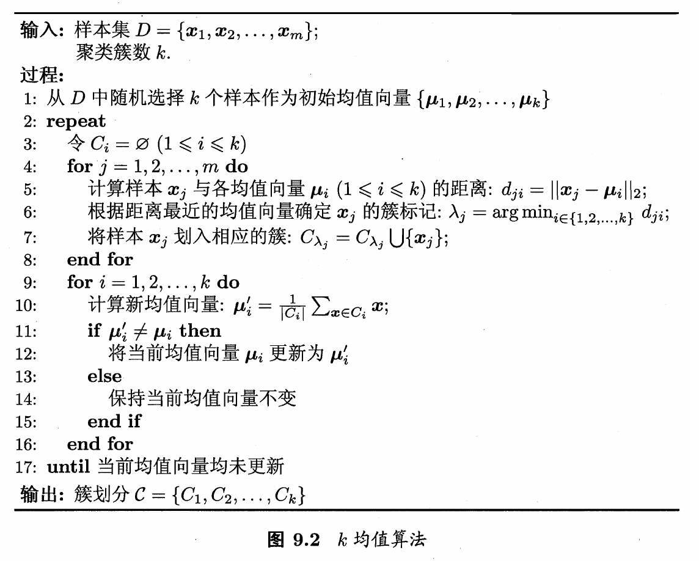
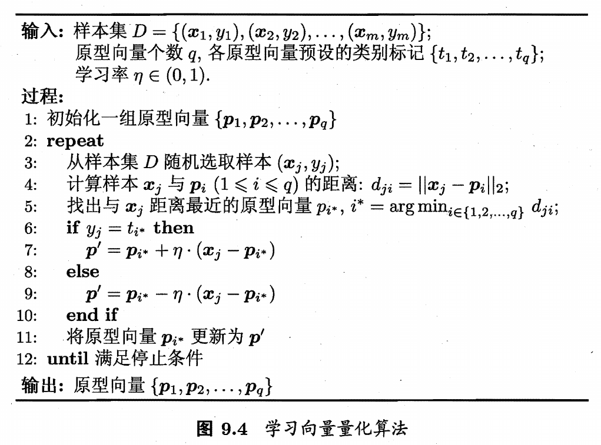
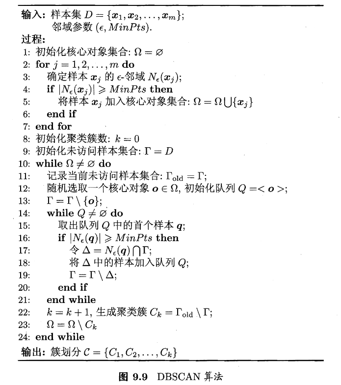
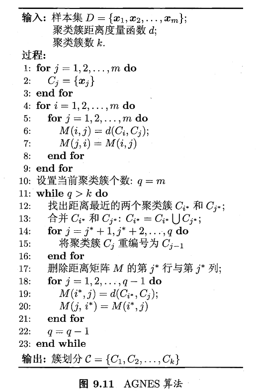

## 聚类任务

聚类是无监督学习任务，样本的标记信息未知，聚类试图将数据集中的样本划分为若干个通常是不相交的子集，每个子集称为一个簇，聚类仅能自动形成簇结构，不一定具有明确的概念语义

聚类既可以作为一个单独过程，寻找数据内在的分布结构，也可作为其他任务的前驱过程

输入样本集包含m个无标记样本，聚类为每个样本生成一个簇标记，聚类结果可用一串簇标记向量表示

## 性能度量

聚类的性能度量大致分为两类

-   外部指标：与某个参考模型的结果比较
-   内部指标：直接观察聚类结果，不参考外部模型

对于外部指标，令$\lambda$为聚类模型结果，$\lambda^*$为参考模型结果，样本集$D=\{x_1,x_2,...,x_m\}$，有以下定义

$$
\begin{aligned}
a&=\vert SS\vert,&SS=\{(x_i,x_j)\vert\lambda_i=\lambda_j,\lambda^*_i=\lambda^*_j,i<j\}\\
b&=\vert SD\vert,&SD=\{(x_i,x_j)\vert\lambda_i=\lambda_j,\lambda^*_i\ne\lambda^*_j,i<j\}\\
c&=\vert DS\vert,&DS=\{(x_i,x_j)\vert\lambda_i\ne\lambda_j,\lambda^*_i=\lambda^*_j,i<j\}\\
d&=\vert DD\vert,&DD=\{(x_i,x_j)\vert\lambda_i\ne\lambda_j,\lambda^*_i\ne\lambda^*_j,i<j\}
\end{aligned}
$$

基于以上定义，有如下指标，指标值越大，效果越好

-   Jaccard系数：$JC={a\over a+b+c}$
-   FM指数：$FMI=\sqrt{\frac{a}{a+b}\cdot\frac{a}{a+c} }$
-   Rand指数：$RI={2(a+d)\over m(m-1)}$

对于内部指标，考虑聚类后样本之间的距离，对簇$C=\{C_1,C_2,...,C_k\}$，定义$dist(\cdot,\cdot)$为距离计算函数

$$
\begin{aligned}
avg(C)&={2\over\vert C\vert(\vert C\vert-1)}\sum\limits_{1\le i<j\le\vert C\vert}dist(x_i,x_j)\\
diam(C)&=\max\limits_{1\le i<j\le\vert C\vert}dist(x_i,x_j)\\
d_\min(C_i,C_j)&=\min\limits_{x_i\in C_i,x_j\in C_j}dist(x_i,x_j)\\
d_{cen}(C_i,C_j)&=dist(\mu_i,\mu_j)
\end{aligned}
$$

其中$avg(C)$表示簇C内样本间的平均距离，$diam(C)$表示簇C内样本间的最大距离，$d_\min$表示簇$C_i$和簇$C_j$最近样本间的距离，$d_{cen}$表示簇$C_i$和簇$C_j$中心点间的距离

基于以上定义，有以下指标

-   DB指数：$DBI={1\over k}\sum\limits_{i=1}^k\max\limits_{j\ne i}({avg(C_i)+avg(C_j)\over d_{cen}(\mu_i,\mu_j)})$，DBI值越小越好
-   Dunn指数：$DI=\min\limits_{1\le i\le k}\{\min\limits_{j\ne i}({d_\min(C_i,C_j)\over\max\limits_{1\le l\le k}diam(C_l)})\}$，DI值越大越好

## 距离计算

在计算两个样本间的距离时，最常用的是闵可夫斯基距离，即$x_i-x_j$的$L_p$范数，**用于有序属性**（包含连续属性和具有序关系的离散属性）

$$
dist(x_i,x_j)=(\sum\limits_{u=1}^n\vert x_{iu}-x_{ju}\vert^p)^{1\over p}
$$

**对于无序属性，可采用VDM距离**，令$m_{u,a}$表示属性u上取值为a的样本数，$m_{u,a,i}$表示第i个簇中属性u上取值为a的样本数，k为簇数，两个属性u的离散值a与b的VDM距离为

$$
VDM_p(a,b)=\sum\limits_{i=1}^k\vert{m_{u,a,i}\over m_{u,a} }-{\frac{m_{u,b,i} }{m_{u,b} } }\vert^p
$$

对于不同的属性也可赋予不同的权重，在求和时变为加权求和

使用距离计算本质是度量两个样本的相似度，但直接使用相似度度量未必能满足距离度量的性质要求，有时需要根据样本来设计不同的距离计算式，可以通过距离度量学习来实现

## 原型聚类

原型聚类是指基于原型的聚类，首先初始化一组原型，之后不断地对原型进行迭代更新

### k均值聚类

k均值聚类的目标是最小化样本与均值向量的平方误差

$$
\begin{aligned}
E&=\sum\limits_{i=1}^k\sum\limits_{x\in C_i}\vert\vert x-\mu_i\vert\vert_2^2\\
\mu_i&={1\over\vert C_i\vert}\sum\limits_{x\in C_i}x
\end{aligned}
$$

算法流程如下

1.   初始化均值向量，随机选择k个样本作为k个均值向量
2.   计算每个样本与所有均值向量的距离，将样本划分到距离最近的簇中
3.   基于每个簇中的样本计算新的均值向量，若与当前均值向量不同，则更新均值向量
4.   重复第2,3步

### 学习向量量化

学习向量量化简称LVQ，它假设样本带有标记，利用样本标记来辅助聚类，给定样本集$D=\{(x_1,y_1),(x_2,y_2),...,(x_m,y_m)\},y\in\Upsilon$，LVQ的输出为一组原型向量，每个原型向量代表一个簇，同时簇标记$t_i\in\Upsilon$

算法流程如下

1.   初始化一组原型向量
2.   随机选择一个样本，计算样本与原型向量的距离，找到与样本距离最近的原型向量
3.   根据样本的标记是否等于该原型向量的预设标记，更新该原型向量，**这一步更新后原型向量会更加接近或远离样本**

在学习得到原型向量后，每个原型向量表示了一个簇区域，该区域中**每个样本与原型向量的距离不大于它与其他原型向量的距离**，这样基于原型向量对样本空间进行划分，称为Voronoi剖分

同时，将簇内的向量全部使用原型向量表示，就实现了样本的有损压缩，称为向量量化

## 密度聚类

密度聚类假设聚类结构能通过样本分布的紧密程度确定。通常情形下，密度聚类算法从样本密度的角度来考察样本之间的可连接性，并基于可连接样本不断扩展聚类簇，以获得最终的聚类结果

DBSCAN算法是一种著名的密度聚类算法，它定义两个参数$\epsilon$和$MinPts$定义密度，对于任意一个样本，以该样本为中心，$\epsilon$为长度，刻画出该样本的**邻域**，若邻域内的样本数至少有$MinPts$个，则该样本称为**核心对象**，位于该邻域内的样本与核心对象**密度直达**，经过传递，两个样本可达称为**密度可达**，DBSCAN中将簇定义为由密度可达关系导出的最大相连样本集合

## 层次聚类

层次聚类试图在不同层次对数据集进行划分，从而形成树形的聚类结构，数据集的划分可采用自底向上的聚合策略，也 可采用自顶向下的分拆策略

AGNES是一种采用自底向上聚合策略的层次聚类算法。它先将数据集中的每个样本看作一个初始聚类簇，然后在算法运行的每一步中找出距离最近的两个聚类簇进行合并，该过程不断重复，直至达到预设的聚类簇个数

