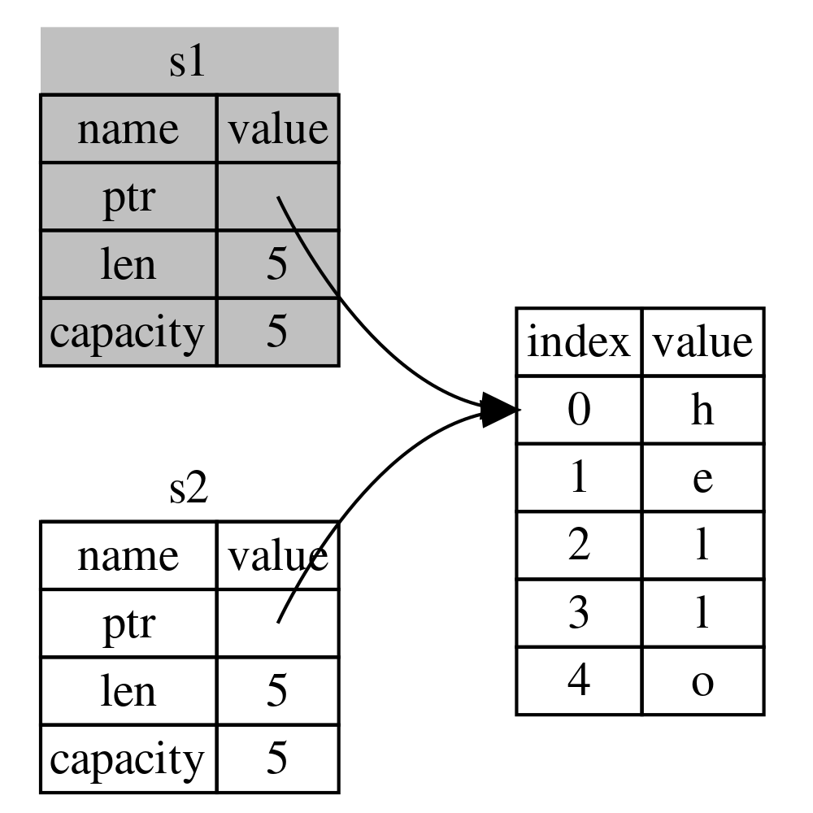
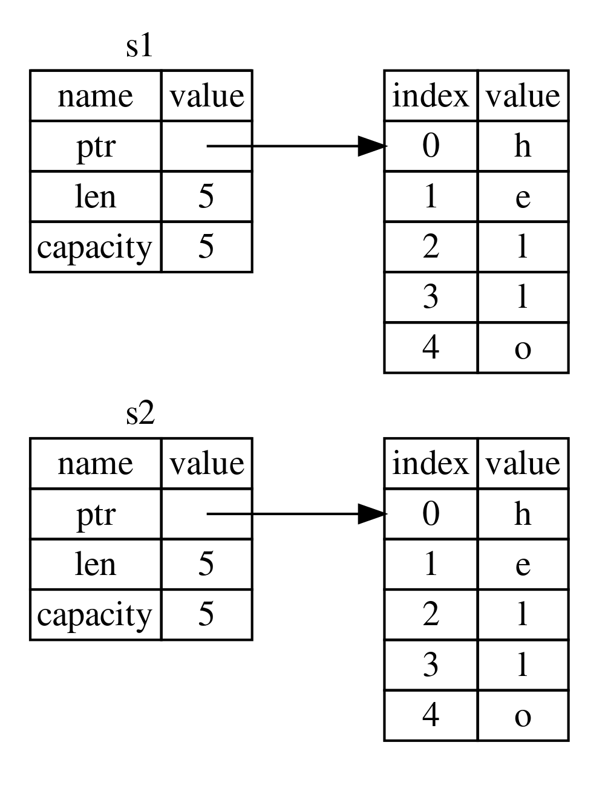

## 开始

所有权（*ownership*）是Rust用于如何管理内存的一组规则。所有程序都必须管理其运行时使用计算机内存的方式，通过所有权系统管理内存，编译器在编译时会根据一系列的规则进行检查。如果违反了任何这些规则，程序都不能编译。在运行时，所有权系统的任何功能都不会减慢程序

## 所有权规则

所有权系统遵循三条规则

- rust中的每个值都有一个所有者
- 值在任何时刻仅有一个所有者
- 当所有者离开作用域时，值将被丢弃

rust中的数据有两种内存分配方式，分别是分配栈内存和分配堆内存

- 栈分配：存储大小固定的数据，例如整数、布尔值、浮点数、字符、引用
- 堆分配：存储动态大小的数据，例如字符串对象、动态数组、哈希表，在运行时分配内存

> 字符串字面量是**不可变**的，存储在**只读内存**中，而字符串对象是可变的，存储在堆中
>
> ```rust
> let s1 = "hello";  // 字面量
> let s2 = String::from("hello1");  // 字符串对象
> ```
{: .prompt-info}

当拥有数据的所有者（变量）离开作用域时，数据占用的内存就被自动释放（rust在底层调用了`drop`函数释放内存）

```rust
fn main() {
    {
        let s = String::from("hello");  // 从此处起，s 是有效的
        // 使用 s
    }
    // s 不再有效
}
```

## 变量与数据的交互

- **移动**

  ```rust
  let s1 = String::from("hello");
  let s2 = s1;  // 所有权移动
  ```

  为字符串对象分配堆内存，s1指向该内存区域，将s1赋值给s2，则s2也指向这块内存

  此时，若s1和s2都离开作用域，会调用两次`drop`函数，产生二次释放的错误，因此，rust规定在此处赋值时，进行所有权移动，即赋值后s2是这个数据的所有者，s1无效，释放后不会清理任何资源

  

- **克隆**

  ```rust
  let s1 = String::from("hello");
  let s2 = s1.clone();
  ```

  调用`clone`函数进行克隆，即深拷贝，此时，s1依然有效，是hello字符串对象内存的所有者，s2则是复制后的内存的所有者

  

- 浅拷贝

  ```rust
  let x = 5;
  let y = x;
  ```

  对于只在栈上的数据，赋值给其他变量时进行浅拷贝，此时x依然有效

> `Drop` trait和`Copy` trait
>
> - `Copy` trait：可以用在类似整型这样的**存储在栈上**的类型上，对于实现了`Copy` trait的类型，它的变量在赋值给其他变量后依然可用，**不会发生所有权移动**
> - `Drop` trait：用于离开作用域时需要释放资源的类型，它的变量在赋值给其他变量时会**发生所有权移动**，旧变量会失效
> - `Copy` trait和`Drop` trait是互斥的，不允许实现了`Drop` trait的类型使用`Copy` trait
>
> rust的**所有变量都具有对数据的所有权**，无论这个数据在栈上分配还是在堆上分配
{: .prompt-info }

## 所有权与函数

### 参数传递

将数据传入函数时，数据会进行移动或拷贝

- 对于堆中的数据，所有权会在传入参数时移动到函数的参数上，移动后，外部的变量不再拥有所有权
- 对于栈中的数据，传入参数时会进行浅拷贝，外部的变量依然拥有所有权

```rust
fn main() {
    let s = String::from("hello");
    takes_ownership(s);  // s的值移动到函数里
    // 所有权被移动，到这里不再有效

    let x = 5;
    makes_copy(x);  // x应该移动函数里，但i32是Copy的，所以在后面可继续使用x
}

fn takes_ownership(some_string: String) {
    println!("{some_string}");
}  // some_string移出作用域并调用drop方法，占用的内存被释放

fn makes_copy(some_integer: i32) {
    println!("{some_integer}");
}
```

### 返回值传递

函数在返回时，会将返回值的所有权移动到外部变量中，或者将数据复制到外部变量

```rust
fn main() {
    let s1 = gives_ownership();  // 函数将返回值的所有权移动到s1

    let s2 = String::from("hello");
    // s2的所有权移动到函数参数，s2无效
    let s3 = takes_and_gives_back(s2);  // 函数将返回值的所有权移动到s3
}

fn gives_ownership() -> String {
    let some_string = String::from("yours");
    some_string  // 返回some_string，some_string的所有权移动到外部变量
}

fn takes_and_gives_back(a_string: String) -> String {
    // 外部变量的所有权移动到a_string
    a_string  // 返回a_string，所有权移动到外部变量
}
```

## 引用

当向函数传参时，所有权会移动到参数中，导致外部变量无效。为了在函数调用后继续使用原变量，此时需要使用引用

**引用可以获取变量值而不会移动所有权**

使用`&`运算符创建一个引用，创建一个引用的行为称为**借用**，引用从创建到最后一次使用的一段时间称为**借用期**

```rust
fn main() {
    let s1 = String::from("hello");
    let len = calculate_length(&s1);  // 使用&获取变量的引用
    println!("The length of '{s1}' is {len}.");  // s1的所有权没有被移动，依然有效
}

// 参数类型加上&，表示类型是引用
fn calculate_length(s: &String) -> usize {
    s.len()
}
```

> 引用的逆操作是解引用，使用解引用运算符`*`
{: .prompt-info}

### 可变引用

引用值默认是**不可变**的，若需要修改引用的值，需要使用可变引用

使用`&mut`创建一个可变引用

```rust
fn main() {
    let mut s = String::from("hello");
    change(&mut s); // 创建可变引用，引用的变量值应该是可变的
}

// 指明参数的类型是一个可变引用
fn change(some_string: &mut String) {
    some_string.push_str(", world");
}
```

多个可变/不可变引用的使用遵循以下规则

- 对于一个变量值，在借用期内不能使用其他可变引用

  ```rust
  let mut s = String::from("hello");
  let a = &mut s;
  let b = &mut s;  // 不合法
  println!("{a}");
  ```

- 对于一个变量值，在借用期内可以使用多个不可变引用

  ```rust
  let s = String::from("hello");
  let a = &s;
  let b = &s;  // 合法
  println!("{a}{b}");
  ```

- 对于一个变量值，在借用期内不可同时使用它的可变引用和不可变引用

  ```rust
  let mut s = String::from("hello");
  let a = &s;
  let b = &mut s;  // 不合法
  println!("{a}");
  
  let c = &mut s;
  let d = &s;  // 不合法
  println!("{c}");
  ```

- 对于一个变量值，必须在借用期结束后才可以继续借用

  ```rust
  let mut s = String::from("hello");
  let a = &mut s;
  println!("{a}");  // 最后一次使用a引用，a的借用期结束
  
  let b = &s;  // 可以继续借用
  println!("{b}");
  ```

### 悬垂引用

当指针指向的内存被释放，而指针依然存在时，指针会变为悬垂指针，对于引用，则称为悬垂引用（Dangling Reference）

在rust中，rust编译器确保悬垂引用永远不会存在

```rust
fn main() {
    let reference_to_nothing = dangle();
}

fn dangle() -> &String {
    let s = String::from("hello");
    &s  // 不合法
    // s离开作用域后，内存被释放，而引用被返回到外部，引用依然存在
}
```

## Slice类型

Slice类型是一个引用，可以引用集合中的一段连续序列，不具有所有权

切片的基本形式是`&variable[start..end]`，范围为左闭右开，最常用的切片主要有字符串切片和数组切片

- 字符串切片

  ```rust
  let s = String::from("hello");
  let s1: &str = &s[1..3];  // 
  ```

- 数组切片

  ```rust
  let arr = [1, 2, 3, 4];
  let a1: &[i32] = &arr[1..3];
  ```

slice引用是一个**不可变引用**，依然遵循借用期规则

```rust
let mut s = String::from("hello");
let s1 = &s[1..3];
let s2 = &mut s;  // 不合法，借用期内不能同时使用可变引用和不可变引用
println!("{s1}");
```

### 切片引用

切片返回的类型是`&str`和`&[i32]`，此处必须使用引用。若使用`str`和`[i32]`类型，编译器会抛出以下错误

```
the size for values of type `str` cannot be known at compilation time [E0277]
```

表示`str`类型的长度在编译期不可知

这是因为`str`和`[i32]`是[动态大小类型（DST）](https://course.rs/advance/into-types/sized.html#sized-和不定长类型-dst)，它的大小在编译期不可知，因此rust无法在栈上为变量分配内存，而引用类型包含一个指向动态大小内存的指针和内存大小信息，引用类型本身的大小是可知的，rust可以在栈上为它分配内存，因此此处应该使用引用类型`&str`和`&[i32]`

> 这同时也反映了动态大小类型只能通过引用间接使用，切片与切片引用可参考：[切片和切片引用](https://course.rs/difficulties/slice.html)
{: .prompt-info}

**String和str**

rust中有两种字符串类型，分别是`String`和`str`

- `String`

  rust标准公共库提供的类型，也是最常用的字符串类型，具有所有权

  `String`在栈上保存一个固定大小的结构体，其中保存了指向堆内存的指针、字符串的长度以及字符串的容量，字符串内容在堆上分配内存

- `str`

  rust底层的数据类型，是一个动态大小类型，无法直接使用

  `str`的引用类型`&str`可以**引用任意动态大小的字符串**，包括字符串对象和字符串字面量（可以认为字符串字面量的类型就是`&str`）
  
  ```rust
  let s = String::from("hello");
  let s1: &str = &s;
  let s2: &str = "hello1";
  ```

